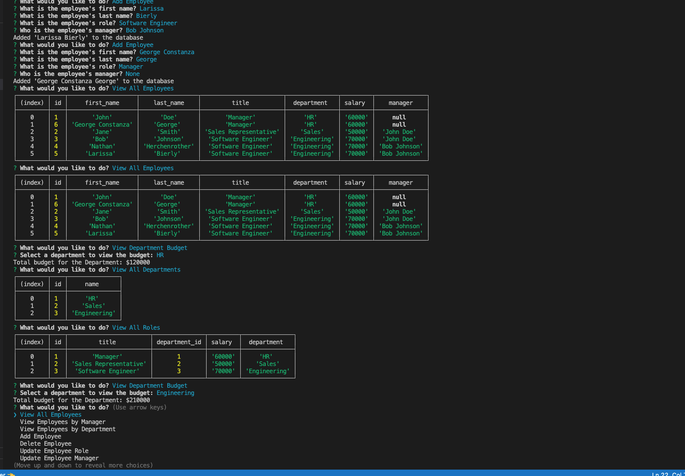

# Employee Tracker

## Description

- My motivation behind this project was to create an interactive prompt to track and maintain employees, roles and departments.
- I built this project to help users easily manipulate data for employees, their roles and their departments using mysql to maintain data and inquirer to prompt the user for changes or inquiries about tables.
- This allows for an easy way for users to update data through a simple prompt for them to choose, add or delete employees, roles and departments and change the data in a database.
- I learned how to use node, mysql, and inquirer to prompt a user, save their inputs, and retrieve data from a database.    

## Table of Contents 

- [Installation](#installation)
- [Usage](#usage)
- [License](#license)

## Installation

The application is started by typing "git clone https://github.com/hershrva/employee-tracker.git" into the users Visual Studio Code or any CLI for running Git commands in a new directory.  The user should then install mysql if not already installed.

## Usage

The application works by running "mysql -u root" in the command line after cloning and installing the repository.(Screenshot #1)  After entering mysql the user should enter "SOURCE db/schema.sql;" to create the database and tables, then "SOURCE db/seeds.sql;" to seed the database and tables. The user should then exit by typing in "exit" while in mysql and then type in "npm i" and "npm start" to the command line in the terminal while in the main folder(Screenshot #2).  The program will start allowing the user to access the database and manipulate the data tables for employees, roles, and departments.(Screenshot #3)  They can find eployees by manager and department, update employees roles and manger, view a departments budget, etc.(Screenshot #4) 

A video demonstration can be found here: https://drive.google.com/file/d/1xvPJGbL39-bcmAwlkO23PzMwXOwyFPWk/view

## License

MIT License

Copyright (c) 2023 hershRVA

Permission is hereby granted, free of charge, to any person obtaining a copy
of this software and associated documentation files (the "Software"), to deal
in the Software without restriction, including without limitation the rights
to use, copy, modify, merge, publish, distribute, sublicense, and/or sell
copies of the Software, and to permit persons to whom the Software is
furnished to do so, subject to the following conditions:

The above copyright notice and this permission notice shall be included in all
copies or substantial portions of the Software.

THE SOFTWARE IS PROVIDED "AS IS", WITHOUT WARRANTY OF ANY KIND, EXPRESS OR
IMPLIED, INCLUDING BUT NOT LIMITED TO THE WARRANTIES OF MERCHANTABILITY,
FITNESS FOR A PARTICULAR PURPOSE AND NONINFRINGEMENT. IN NO EVENT SHALL THE
AUTHORS OR COPYRIGHT HOLDERS BE LIABLE FOR ANY CLAIM, DAMAGES OR OTHER
LIABILITY, WHETHER IN AN ACTION OF CONTRACT, TORT OR OTHERWISE, ARISING FROM,
OUT OF OR IN CONNECTION WITH THE SOFTWARE OR THE USE OR OTHER DEALINGS IN THE
SOFTWARE.

